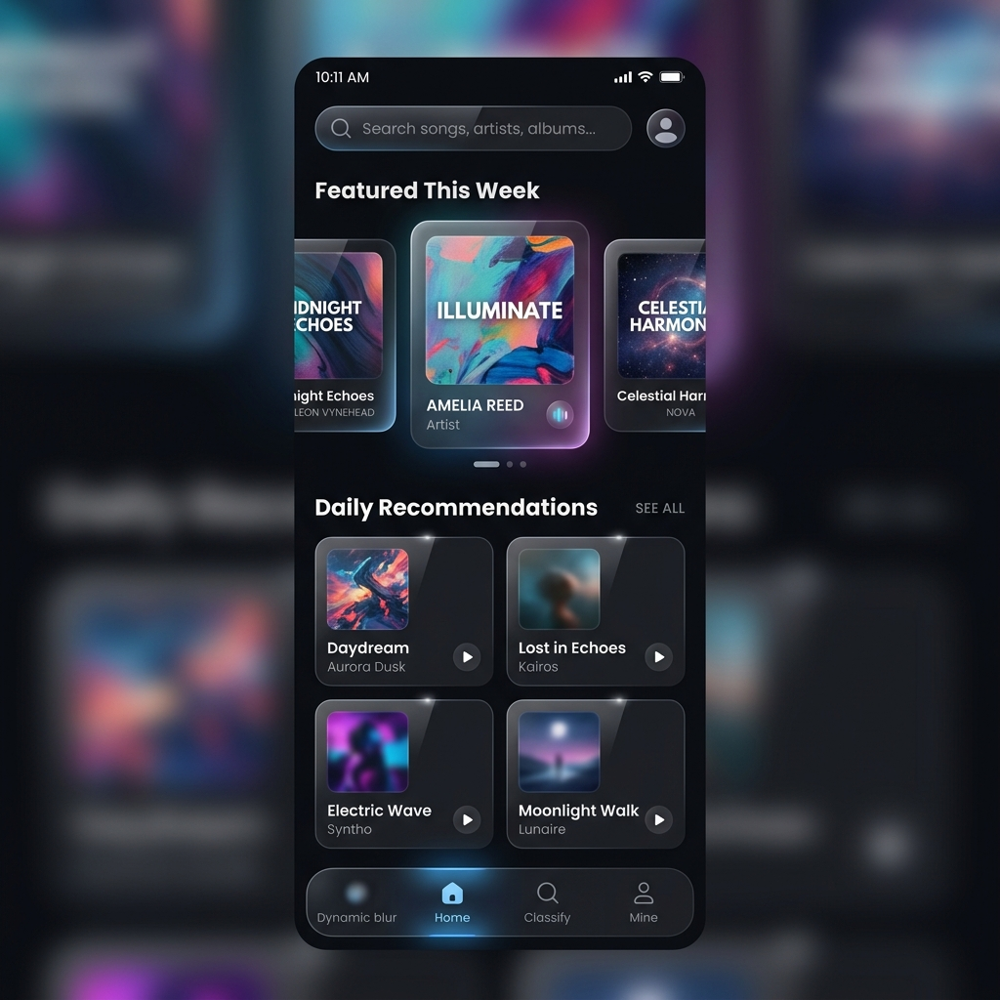
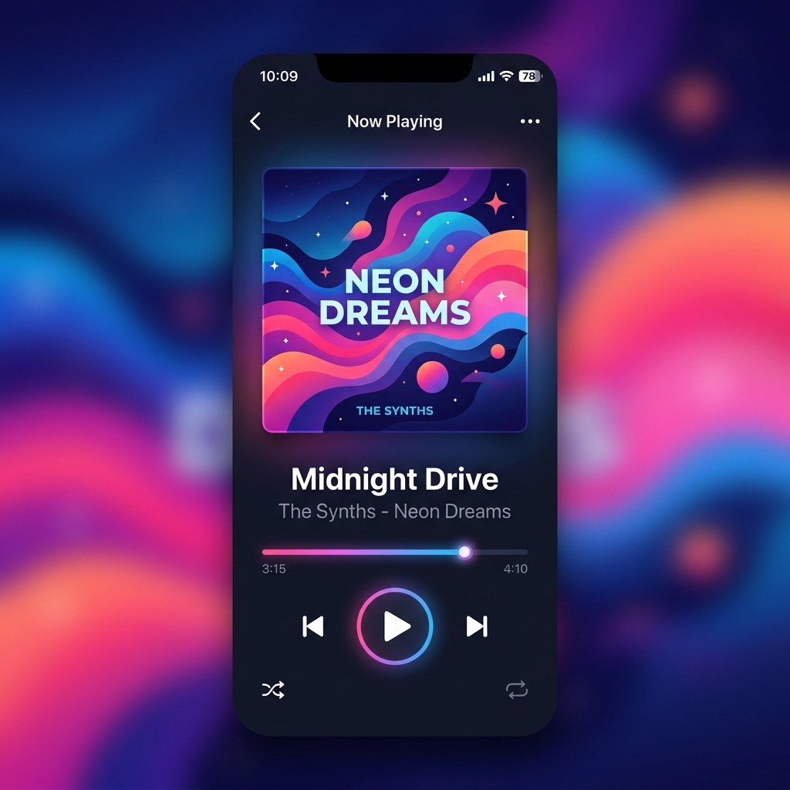
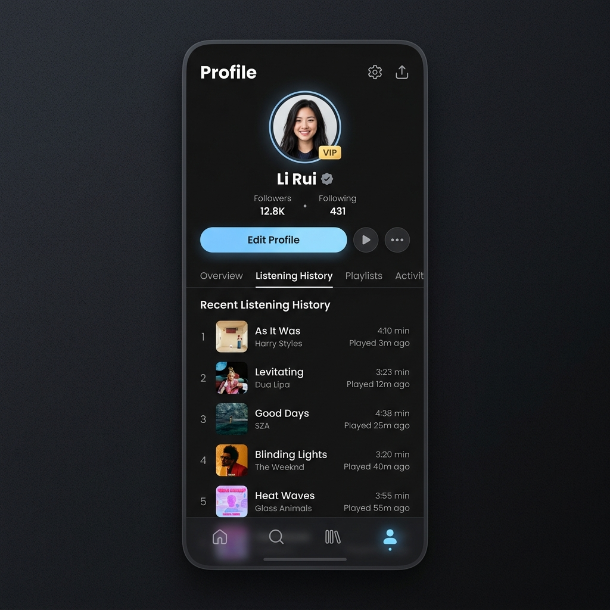

# 智联音悦 (HarmonyStream) - 实验三 (分布式与高级特性)

## 1. 项目简介

智联音悦（HarmonyStream）是一个基于 HarmonyOS ArkTS Stage 模型开发的高性能音乐流媒体应用。本项目遵循一次开发、多端部署（Write Once, Run Anywhere）的核心理念，深度融合鸿蒙分布式特性与沉浸式 UI 设计规范。

**当前阶段：高阶系统集成**  
在最终的实验三阶段，项目彻底点亮了所有高阶能力，包括基于 HTTP 请求的 Node.js 本地微服务端、万能服务卡片（WidgetCard），以及底层的 AVPlayer 多媒体播放内核封装。

## 2. 核心页面展示

为了更直观地展现本应用的交互视觉，以下是真机运行的高清截图：

### 2.1 首页探索 (Explore & Discover)
首页采用深色毛玻璃材质，顶部全局搜索与轮播图结合，无缝衔接每日推荐与热门歌单。

### 2.2 沉浸式播放器 (Immersive Player)
播放界面根据专辑封面动态提取主题色，实现全屏沉浸式的流光渐变效果，支持全手势控制播放进度。

### 2.3 个人中心 (Mine Profile)
个人中心聚合了用户的音乐历史、动态广场和设置入口。支持深浅模式无感切换。

## 3. 技术栈解析

| 核心技术 | 框架说明 | 模块支撑 |
| --- | --- | --- |
| **应用模型** | Stage 模型 | 全局统一架构 |
| **开发语言** | ArkTS (ETS) | 高性能声明式语言 |
| **UI 范式** | ArkUI | 自定义组件、多端适配、响应式栅格 |
| **状态管理** | @State, @Provide, @Consume | 跨页面、跨层级组件数据同步 |
| **数据持久化** | Preferences, RelationalStore | 缓存用户鉴权态与播放历史 |
| **网络请求** | @ohos.net.http | 二次封装 RESTful 请求栈 |

## 4. 环境配置与部署指南

### 4.1 开发环境
- **IDE**: DevEco Studio (最新版)
- **SDK**: HarmonyOS API 9 / API 10+
- **构建工具**: Hvigor & OHPM (OpenHarmony Package Manager)

### 4.2 运行步骤
1. 克隆本项目并使用 DevEco Studio 打开根目录。
2. 确保网络通畅，系统会自动调用 ohpm install 下载全量依赖库。
3. 在上方设备列表中选择 Local Emulator (本地模拟器) 或通过 USB 连接 HarmonyOS 真机。
4. 点击右上角 **Run 'entry'** 开始编译。
5. 编译通过后，应用将自动安装并运行至目标设备。

## 5. 项目贡献与声明

- **主导开发**：李瑞 (ID: 25307087)
- **开源声明**：本项目遵循 MIT 开源协议，所有界面设计、交互逻辑及代码实现均由作者独立完成并不断迭代提交。